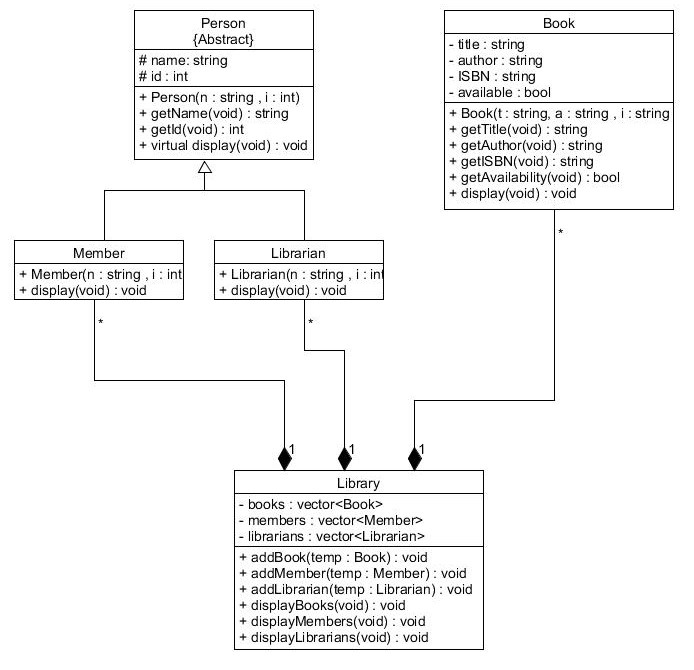

# Library-Management-System
A Library Management System (LMS) is a software application designed to manage the operations of a library. It helps in the systematic organization of books, members and librarians.

## Features
### 1. Book Managment
-   Book Registration
-   Book Details
### 2. Member Managment
-   Member Registration
-   Member Details
### 3. Librarian Managment
-   Librarian Registration
-   Librarian Details

### 3. Library Managment
-   Displaying Library members, librarians and books
## System Components
### 1. Classes
-   Library: Manages the overall library system.
-   Book: Represents a book with attributes like title, author, ISBN, and availability status.
-   Member: Represents a library member with attributes like name, member ID.
-   Librarian: Represents a library member with attributes like name, member ID.
-   Person: Serves as an abstract class

### 2.Data Structures 
-   usage of STL containers like vector

## Class Diagram
